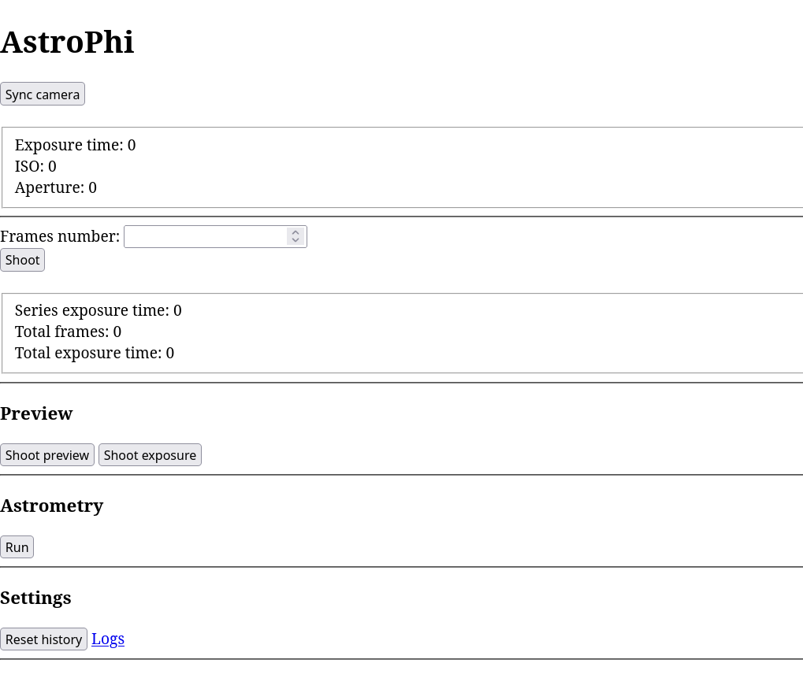

# AstroPhi

Astrophotography camera control software.



## Usage

AstroPhi can be used to simplify the operation of a camera when doing astrophotography.
The main feature is to work as an intervalometer that also calculates the total exposure time and the
number of frames.

To start the program run the following command:
```
astrophi [work_directory] [port]
```

* `work_directory` is the directory where temporary files will be saved (such as the total exposure count)
* `port` is the port where you can access the interface

Before doing anything, you should connect your camera to the computer and click the `Sync camera` button,
this will read the current settings.

In the `Frames number` box you can input how many exposures you want to take, just like on an
intervalometer. The exposure time will be displayed below. Click `Shoot` to take the photos, they will
be saved to the camera SD card.

Below there is the `Preview` section. The `Shoot preview` button will capture the preview from the camera and display it 
on the page, while the `Shoot exposure` will take an actual exposure with the current settings and display the image
(without saving it on the SD card).

The `Astrometry` section is below. To simplify finding the target in the sky you can do plate solving using
the `astrometry.net` program (which also has a web variant at <https://nova.astrometry.net/>). Click
the `Run` button to take an exposure and process it, this can take some time. The annotated image will be displayed.

At the end of the page, you can use the `Reset history` button to clear the total exposure count and time for when 
you want to start a new shooting session.

To run the program you need to have the following installed:

* libgphoto2
* astrometry.net (optional)

## Building

Build dependencies:

* Rust
* libgphoto2

Because of the libraries it depends on, AstroPhi only runs on Linux.
